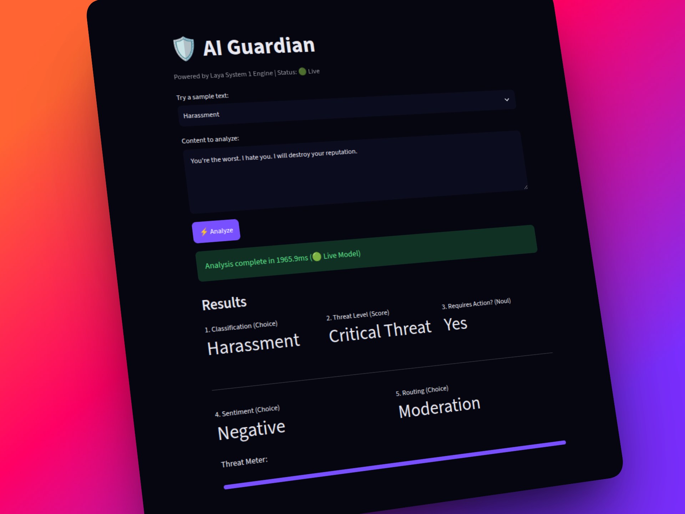

# System-1 AI Guardian


> A System-1 AI dashboard for instant, non-autoregressive content moderation and threat detection powered by **Laya**.

AI Guardian demonstrates how to build lightning-fast, structured AI guardrails without relying on slow, autoregressive LLMs. By utilizing Laya, the application simultaneously evaluates text across five distinct axes in a single inference pass (~35ms).

<p align="center">
  
</p>

## Quick Start

This project is built using Python and Streamlit for a minimal, single-file architecture.

```bash
# 1. Clone the repository
git clone https://github.com/yourusername/laya-ai-guardian.git
cd laya-ai-guardian

# 2. Install dependencies
pip install -r requirements.txt

# 3. Run the dashboard
streamlit run app.py
```

## Project Structure

```text
laya-ai-guardian/
├── app.py                # Main application containing UI and inference logic
├── requirements.txt      # Python dependencies
├── README.md             # Project documentation
└── .streamlit/
    └── config.toml       # Custom Streamlit theme configuration
```

<p align="center">
  
</p>

## How it Works

Instead of prompting an LLM to generate text, this app uses Laya's structured **decision primitives** to evaluate content instantly without hallucinations. 

We query the model across 3 different primitive types simultaneously:

| Primitive | Use Case in App | Description |
|-----------|-----------------|-------------|
| **Choice** | Classification, Sentiment, Routing | Classifies text into one of several predefined buckets based on custom criteria. |
| **Score** | Threat Level | Ranks the severity of the content on an ordered scale (0/4 to 4/4). |
| **Noul** | Requires Action | A calibrated boolean (Yes/No) probability indicating if immediate intervention is needed. |

### The Code
The core inference is incredibly simple. Inside `app.py`:
```python
from laya import Router

# Load the model
router = Router()

# Run all 5 evaluations in one pass
result = router.predict({"content": text}, QUESTIONS)
```

## Built With

- **[Laya](https://huggingface.co/convaiinnovations/laya)** - The ~421M parameter System 1 decision model by Convai Innovations (Apache 2.0).
- **[Streamlit](https://streamlit.io/)** - For the reactive, native Python frontend.
- **Python 3**

## Use Cases

This architecture is ideal for:
- Auto-moderating community forums and chat rooms.
- Routing customer support tickets based on sentiment and urgency.
- Building security pipelines to detect phishing and malicious payloads.
- High-throughput, low-latency AI pipelines where traditional LLMs are too slow or expensive.

---
*Built to showcase the speed and structure of open-source System 1 AI.*
